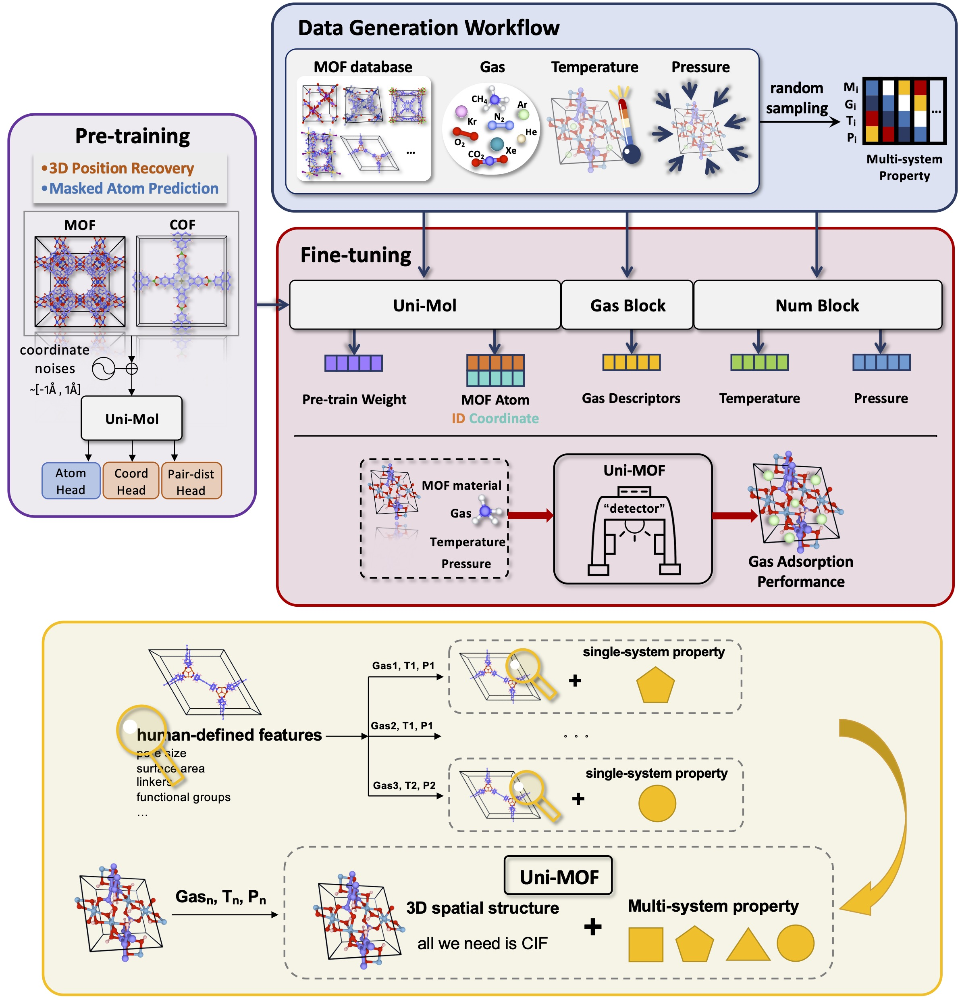

Official Repository for the Uni-MOF Series Methods
==================================================

<!-- Uni-MOF: A Universal 3D Material Representation Learning Framework for Gas Adsorption in MOFs -->
Metal-organic frameworks meet Uni-MOF: a revolutionary gas adsorption detector
-------------------------------------------------------------------

[[Paper](https://chemrxiv.org/engage/chemrxiv/article-details/6447d756e4bbbe4bbf3afeaa)]

<a href="https://bohrium.dp.tech/notebook/cca98b584a624753981dfd5f8bb79674" target="_parent"></a>

Authors: Jingqi Wang, Jiapeng Liu, Hongshuai Wang, Guolin Ke, Linfeng Zhang, Jianzhong Wu, Zhifeng Gao, Diannan Lu

<p align="center"></p>
<p align="center"><b>Schematic illustration of the Uni-MOF framework</b></p>

Uni-MOF is an innovative framework for large-scale, three-dimensional MOF representation learning, designed for universal multi-gas prediction.  Specifically, Uni-MOF serves as a versatile "gas adsorption detector" for MOF materials, employing pure three-dimensional representations learned from over 631,000 collected MOF and COF structures.  Our experimental results show that Uni-MOF can automatically extract structural representations and predict adsorption capacities under various operating conditions using a single model.  For simulated data, Uni-MOF exhibits remarkably high predictive accuracy across all datasets.  Impressively, the values predicted by Uni-MOF correspond with the outcomes of adsorption experiments.  Furthermore, Uni-MOF demonstrates considerable potential for broad applicability in predicting a wide array of other properties.

Uni-MOF's data
------------------------------
Code and model weights will be released continuously.


Dependencies
------------
 - [Uni-Core](https://github.com/dptech-corp/Uni-Core), check its [Installation Documentation](https://github.com/dptech-corp/Uni-Core#installation).

To use GPUs within docker you need to [install nvidia-docker-2](https://docs.nvidia.com/datacenter/cloud-native/container-toolkit/install-guide.html#docker) first. Use the following command to pull the docker image:

```bash
docker pull dptechnology/unimol:latest-pytorch1.11.0-cuda11.3
```


<!-- Uni-MOF's data 
------------------------------

For the details of datasets, please refer to Table 1 in our [paper](https://chemrxiv.org/engage/chemrxiv/article-details/6447d756e4bbbe4bbf3afeaa).

There are total 6 datasets:


| Data                     | File Size  | Update Date | Download Link                                                                                                             | 
|--------------------------|------------| ----------- |---------------------------------------------------------------------------------------------------------------------------|
| nanoporous material pretrain | GB   | May 10 2023 |                                |
| gas adsorption property      | GB   | May 10 2023 |          |
| material structural property | GB   | May 10 2023 |                |

We use [LMDB](https://lmdb.readthedocs.io) to store data, you can use the following code snippets to read from the LMDB file.

```python
import lmdb
import numpy as np
import os
import pickle

def read_lmdb(lmdb_path):
    env = lmdb.open(
        lmdb_path,
        subdir=False,
        readonly=True,
        lock=False,
        readahead=False,
        meminit=False,
        max_readers=256,
    )
    txn = env.begin()
    keys = list(txn.cursor().iternext(values=False))
    for idx in keys:
        datapoint_pickled = txn.get(idx)
        data = pickle.loads(datapoint_pickled)
```
We use pickle protocol 5, so Python >= 3.8 is recommended.

Uni-Mol's pretrained model weights
----------------------------------

| Model                     | File Size  |Update Date | Download Link                                                | 
|--------------------------|------------| ------------|--------------------------------------------------------------|
| nanoporous material pretrain   | MB   | May 10 2023 |https://github.com/dptech-corp/Uni-MOF/releases/download/     |


Uni-Mol's finetuned model weights
----------------------------------

| Model                                           | File Size| Update Date| Download Link                                                     | 
|-------------------------------------------------|---------| -----------|--------------------------------------------------------------------|
| hMOF_MOFX_DB         | MB   | May 10 2023 |https://github.com/dptech-corp/Uni-MOF/releases/download    |
| CoRE_MOFX_DB       | MB   | May 10 2023 |https://github.com/dptech-corp/Uni-Mol/releases/download  |
| CoRE_MAP_DB          | MB   | May 10 2023 |https://github.com/dptech-corp/Uni-Mol/releases/download      |
| hMOF_MOFX_DB w/o pretraining  | MB   | May 10 2023 |https://github.com/dptech-corp/Uni-MOF/releases/download    |
| CoRE_MOFX_DB w/o pretraining      | MB   | May 10 2023 |https://github.com/dptech-corp/Uni-Mol/releases/download  |
| CoRE_MAP_DB w/o pretraining         | MB   | May 10 2023 |https://github.com/dptech-corp/Uni-Mol/releases/download      |

Dependencies
------------
 - [Uni-Core](https://github.com/dptech-corp/Uni-Core), check its [Installation Documentation](https://github.com/dptech-corp/Uni-Core#installation).
 - rdkit==2021.09.5, install via `conda install -y -c conda-forge rdkit==2021.09.5`

To use GPUs within docker you need to [install nvidia-docker-2](https://docs.nvidia.com/datacenter/cloud-native/container-toolkit/install-guide.html#docker) first. Use the following command to pull the docker image:

```bash
docker pull dptechnology/unimol:latest-pytorch1.11.0-cuda11.3
```

Material Pretraining
---------------------
```
data_path="./examples/mof" # replace to your data path
save_dir="./save/" # replace to your save path
n_gpu=8
MASTER_PORT=$1
lr=3e-4
wd=1e-4
batch_size=8
update_freq=2
masked_token_loss=1
masked_coord_loss=1
masked_dist_loss=1
dist_threshold=5.0
minkowski_p=2.0
lattice_loss=1
x_norm_loss=0.01
delta_pair_repr_norm_loss=0.01
mask_prob=0.15
noise_type='uniform'
noise=1.0
seed=1
warmup_steps=10000
max_steps=100000
global_batch_size=`expr $batch_size \* $n_gpu \* $update_freq`

export NCCL_ASYNC_ERROR_HANDLING=1
export OMP_NUM_THREADS=1
nohup python -m torch.distributed.launch --nproc_per_node=$n_gpu --master_port=$MASTER_PORT $(which unicore-train) $data_path --user-dir ./unimat --train-subset train --valid-subset valid \
       --num-workers 8 --ddp-backend=c10d \
       --task unimat --loss unimat --arch unimat_base  \
       --optimizer adam --adam-betas '(0.9, 0.99)' --adam-eps 1e-6 --clip-norm 1.0 --weight-decay $wd \
       --lr-scheduler polynomial_decay --lr $lr --warmup-updates $warmup_steps --total-num-update $max_steps \
       --update-freq $update_freq --seed $seed \
       --fp16 --fp16-init-scale 4 --fp16-scale-window 256 \
       --tensorboard-logdir ${save_dir}/tsb \
       --max-update $max_steps --log-interval 1000 --log-format simple \
       --save-interval-updates 1000 --validate-interval-updates 1000 --keep-interval-updates 10 --no-epoch-checkpoints  \
       --masked-token-loss $masked_token_loss --masked-coord-loss $masked_coord_loss --masked-dist-loss $masked_dist_loss \
       --x-norm-loss $x_norm_loss --delta-pair-repr-norm-loss $delta_pair_repr_norm_loss --lattice-loss $lattice_loss \
       --mask-prob $mask_prob --noise-type $noise_type --noise $noise --batch-size $batch_size --dist-threshold $dist_threshold --minkowski-p $minkowski_p \
       --required-batch-size-multiple 1 --remove-hydrogen \
       --save-dir $save_dir \
       --find-unused-parameters \
>> "./logs/${save_dir}.log" &
```
The above setting is for 8 V100 GPUs, and the batch size is 128 (`n_gpu * batch_size * update_freq`). You may need to change `batch_size` or `update_freq` according to your environment. 

Cross-system Gas Adsorption Property Prediction
------------------
```
data_path="./cross-system_gas_adsorption_property_prediction"  # replace to your data path
save_dir="./save_finetune"  # replace to your save path
n_gpu=8
MASTER_PORT=10086
task_name="CoRE"  # property prediction task name
num_classes=1
exp_name="mof_v2" 
weight_path="./weights/checkpoint.pt"  # replace to your ckpt path
lr=3e-4
batch_size=8
epoch=50
dropout=0.2
warmup=0.06
update_freq=2
global_batch_size=`expr $batch_size \* $n_gpu \* $update_freq`
ckpt_dir="${exp_name}_${task_name}_trial"

export NCCL_ASYNC_ERROR_HANDLING=1
export OMP_NUM_THREADS=1

nohup python -m torch.distributed.launch --nproc_per_node=$n_gpu --master_port=$MASTER_PORT $(which unicore-train) $data_path --user-dir ./unimat --task-name $task_name --train-subset train --valid-subset valid,test \
       --num-workers 8 --ddp-backend=c10d \
       --task unimof_v2 --loss mof_v2_mse --arch unimof_v2  \
       --optimizer adam --adam-betas '(0.9, 0.99)' --adam-eps 1e-6 --clip-norm 1.0 \
       --lr-scheduler polynomial_decay --lr $lr --warmup-ratio $warmup --max-epoch $epoch --batch-size $batch_size \
       --update-freq $update_freq --seed 1 \
       --fp16 --fp16-init-scale 4 --fp16-scale-window 256 \
       --num-classes $num_classes --pooler-dropout $dropout \
       --finetune-mol-model ./weights/$weight_path/checkpoint_last.pt \
       --log-interval 500 --log-format simple \
       --validate-interval-updates 500 --remove-hydrogen \
       --save-interval-updates 1000 --keep-interval-updates 10 --no-epoch-checkpoints --keep-best-checkpoints 1 --save-dir ./logs_finetune/$save_dir \
       --best-checkpoint-metric valid_r2 --maximize-best-checkpoint-metric \
> ./logs_finetune/$save_dir.log &
```

Cross-system Gas Adsorption Property Prediction w/o Pretraining
---------------------
```
data_path="./cross-system_gas_adsorption_property_prediction"  # replace to your data path
save_dir="./save_finetune"  # replace to your save path
n_gpu=8
MASTER_PORT=10086
task_name="CoRE"  # property prediction task name
num_classes=1
exp_name="mof_v2" 
weight_path='NoPretrain'
lr=3e-4
batch_size=8
epoch=50
dropout=0.2
warmup=0.06
update_freq=2
global_batch_size=`expr $batch_size \* $n_gpu \* $update_freq`
ckpt_dir="${exp_name}_${task_name}_trial"

export NCCL_ASYNC_ERROR_HANDLING=1
export OMP_NUM_THREADS=1

nohup python -m torch.distributed.launch --nproc_per_node=$n_gpu --master_port=$MASTER_PORT $(which unicore-train) $data_path --user-dir ./unimat --task-name $task_name --train-subset train --valid-subset valid,test \
       --num-workers 8 --ddp-backend=c10d \
       --task unimof_v2 --loss mof_v2_mse --arch unimof_v2  \
       --optimizer adam --adam-betas '(0.9, 0.99)' --adam-eps 1e-6 --clip-norm 1.0 \
       --lr-scheduler polynomial_decay --lr $lr --warmup-ratio $warmup --max-epoch $epoch --batch-size $batch_size \
       --update-freq $update_freq --seed 1 \
       --fp16 --fp16-init-scale 4 --fp16-scale-window 256 \
       --num-classes $num_classes --pooler-dropout $dropout \
       --log-interval 500 --log-format simple \
       --validate-interval-updates 500 --remove-hydrogen \
       --save-interval-updates 1000 --keep-interval-updates 10 --no-epoch-checkpoints --keep-best-checkpoints 1 --save-dir ./logs_finetune/$save_dir \
       --best-checkpoint-metric valid_r2 --maximize-best-checkpoint-metric \
> ./logs_finetune/$save_dir.log &
```

Single-system Gas Adsorption Property Prediction
---------------------
```
data_path="./single-system_gas_adsorption_property_prediction"  # replace to your data path
save_dir="./save_finetune"  # replace to your save path
n_gpu=8
MASTER_PORT=10086
task_name="CoRE_PLD"  # property prediction task name
num_classes=1
exp_name='mof_v1'
weight_path="./weights/checkpoint.pt"  # replace to your ckpt path
lr=3e-4
batch_size=8
epoch=50
dropout=0.2
warmup=0.06
update_freq=2
global_batch_size=`expr $batch_size \* $n_gpu \* $update_freq`

export NCCL_ASYNC_ERROR_HANDLING=1
export OMP_NUM_THREADS=1

nohup python $(which unicore-train) $data_path --user-dir ./unimat --task-name $task_name --train-subset train --valid-subset valid,test \
       --num-workers 8 --ddp-backend=c10d \
       --task unimof_v1 --loss mof_v1_mse --arch unimat_base  \
       --optimizer adam --adam-betas '(0.9, 0.99)' --adam-eps 1e-6 --clip-norm 1.0 \
       --lr-scheduler polynomial_decay --lr $lr --warmup-ratio $warmup --max-epoch $epoch --batch-size $batch_size \
       --update-freq $update_freq --seed 1 \
       --fp16 --fp16-init-scale 4 --fp16-scale-window 256 \
       --num-classes $num_classes --pooler-dropout $dropout \
       --finetune-from-model ./weights/$weight_path/checkpoint_last.pt \
       --log-interval 100 --log-format simple \
       --validate-interval 1 --remove-hydrogen \
       --save-interval-updates 1000 --keep-interval-updates 10 --no-epoch-checkpoints --keep-best-checkpoints 1 --save-dir ./logs_finetune/$save_dir \
       --best-checkpoint-metric valid_r2 --maximize-best-checkpoint-metric \
> ./logs_finetune/$save_dir.log &
```
 -->


Citation
--------

Please kindly cite our papers if you use the data/code/model.
```
@article{wang2023metal,
  title={Metal-organic frameworks meet Uni-MOF: a revolutionary gas adsorption detector},
  author={Wang, Jingqi and Liu, Jiapeng and Wang, Hongshuai and Ke, Guolin and Zhang, Linfeng and Wu, Jianzhong and Gao, Zhifeng and Lu, Diannan},
  year={2023}
}
```

License
-------

This project is licensed under the terms of the MIT license. See [LICENSE](https://github.com/dptech-corp/Uni-MOF/blob/main/LICENSE) for additional details.
